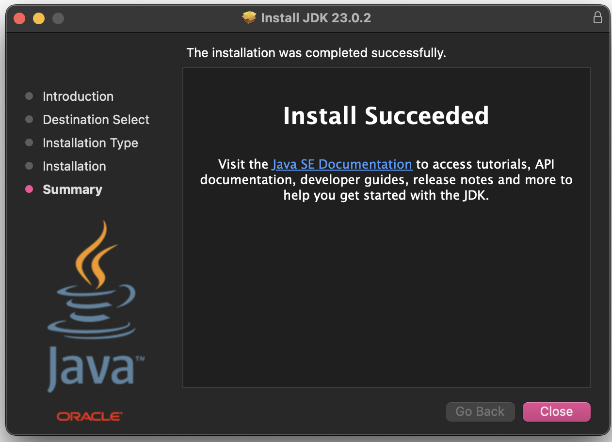
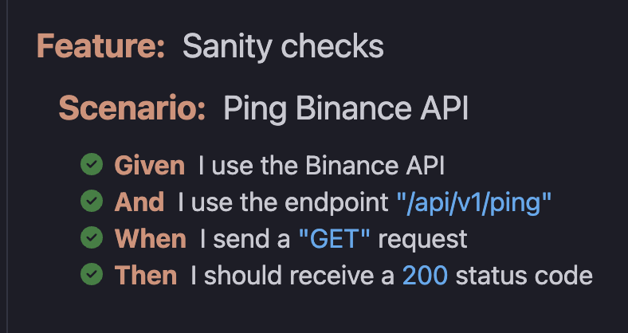
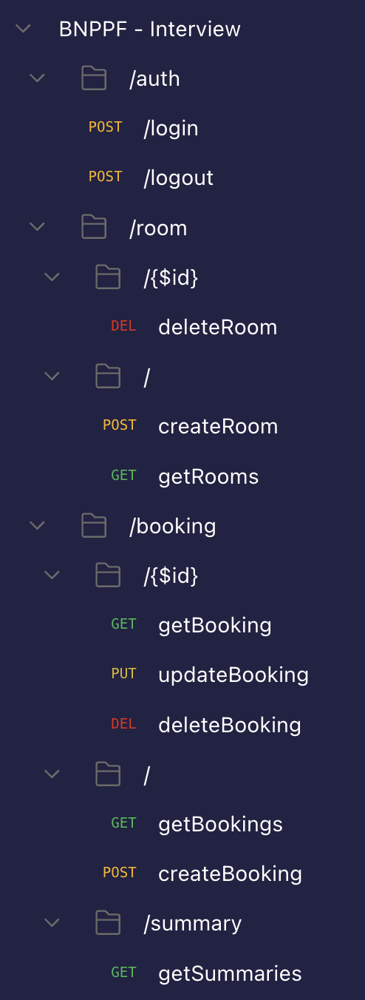
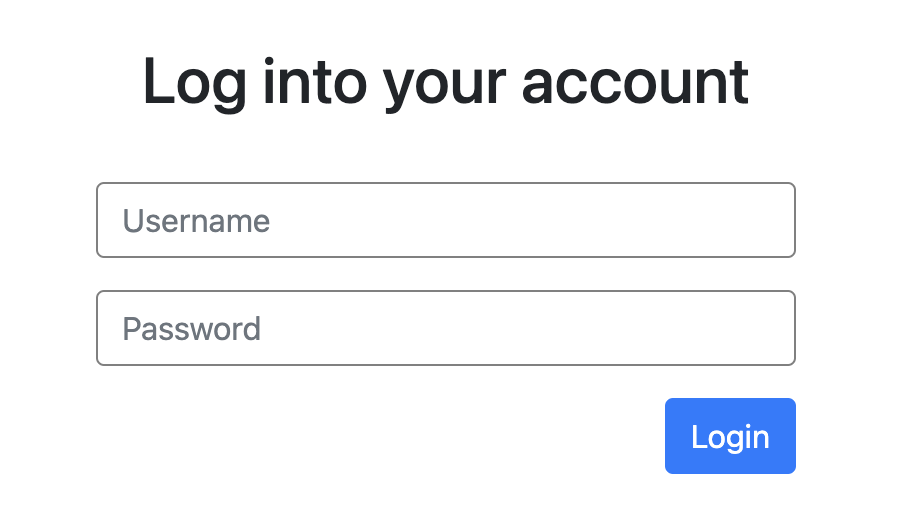
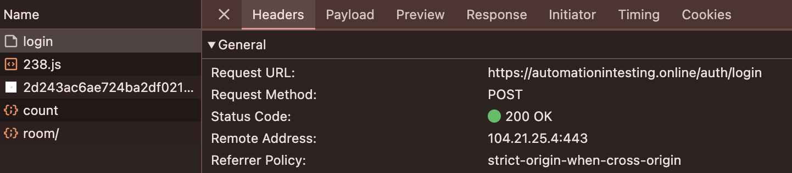
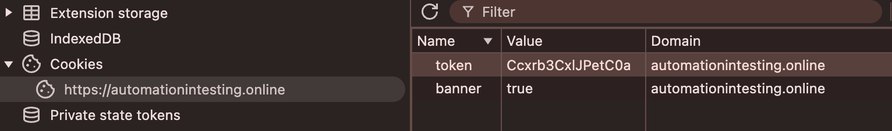
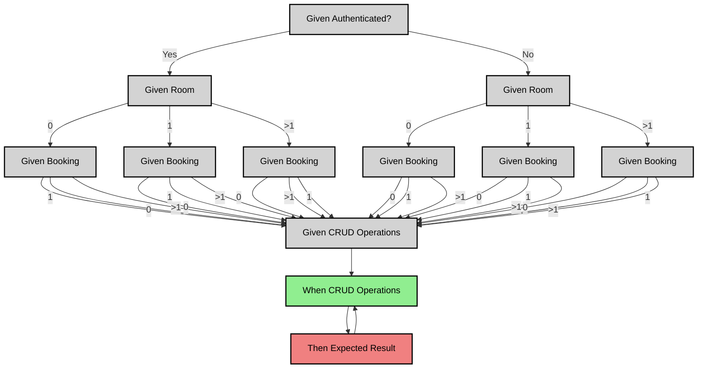

# Interview BNPPF : Test Automation Engineer Position - Exercise

Today is a great day as I am going to code a solution for an exercise proposed by BNPPF Testing Team Lead,for a Test Automation Engineer position. It is currently 25 Jan 2025 9AM and I have 3 days to complete the exercise. I am excited to start coding and learning a few new things along the way. So let's get started!

## Exercise

The goal of the exercise is to create a Test Automation Framework to automate the testing of the APIs used on a hotel booking website located here: https://automationintesting.online/

There are two endpoints which are documented using OpenAPI specification (Swagger):

- `Booking:` https://automationintesting.online/booking/swagger-ui/index.html
- `Message:` https://automationintesting.online/message/swagger-ui/index.html

## Requirements

I am required to use the following tools:

- `Java` as the programming language
- `RestAssured` for API testing
- `Cucumber` for the BDD approach
- `Github` for the version control and to document the progress
- `Design Patterns` to structure the code in a maintainable way
- `Coverage` is left at my discretion but should be wide enough to demonstrate different testing techniques and types of tests

# General Approach

To mimic what would happen in a real setup where I am just one of the many members of the development team, I'll assume that:

- the OpenAPI documentation comes from the Dev Team and I can propose changes in the code exposed to me: here their OpenAPI documentation
- that I have to work with the BAs to define the User Stories in Gherkin language so that they can be used as the basis for the test automation code

Since Scrum is the preferred Dev Methodology for the position, I'll split my work into several sprints, propose some deliverable at the end of each iteration. Finally, I'll also make sure to use the ISTQB jargon as it was a requirement for the position and of course the preferred medium of expression among a team of testers.

# Tools & Methodology

- Operating System: `macOS Sonoma 14.5` on `Apple M2`
- Development Methodology: `Scrum`
- Behavior Driven Development: `Cucumber`
- Programming Language: `Java`
- Java Serialization Library: `Jackson`
- API Testing Library: `RestAssured`
- Test Runner & Assertion Library: `JUnit`
- User Story Definition Language: `Gherkin` through `Cucumber`
- API Requests Prototyping: `Postman` (as a VSCode plugin)
- API Documentation: `OpenAPI`
- Build & Dependencies Manager Tool: `Maven`
- CI/CD: `Github Actions` to launch automated test suites on each push to the main branch
- IDE: `Visual Studio Code`
- Version Control and Project Documentation: `Github`

# Sprint Planning

This process would normally take place over the course of several `Sprint Planning` sessions. Since the exercise is quite concise and I am working alone, I'll already shape the whole agenda in this section. I'll try to split the sprints in a logical way. Here is the general planning for the next sprints:

- Sprint 1: `Test Plan`, `Testing Project Setup` and `Boiler Plate Project Release`
- Sprint 2: `Booking` endpoints testing
- Sprint 3: `Messages`endpoint testing
- Sprint 4: `CI/CD Pipeline Integration` and `Reporting`

# Test Strategy

Let's assume that BNPPF has an overarching `Test Strategy`that gives general guidelines that must be followed by all the testing teams. Due to the nature of the exercise and the AUT, we could imagine having the following `guideline`:

- Before approval from the `Delivery Team`, all new projects should be accompanied by a `Test Plan` that will highlight the approach taken by the Testing Team, and will include:
  - the testing approach: test objectives and test techniques
  - clear test coverage objectives
  - a test results by severity levels
- Moreover, all the critical aspects of the application should be covered by automated test cases integrated in the CD/CI pipeline.
- All endpoints that require authentication should be covered and tested with both valid and invalid credentials.

This is of course a very light of a `Test Strategy` but it will be enough for the purpose of this exercise.

# Sprint 1 - Test Plan, Testing Project Setup and Boiler Plate Project Release

## 1. Test Plan

Here is a simple `Test Plan` for the exercise that should suit all our basic needs:

### 1.1 Introduction

Please refer to [Exercise section](#exercise)

### 1.2 Scope

- Testing both endpoints "Booking" and "Message"
- Testing the OpenAPI documentation as well

### 1.3 Out of Scope

Testing the UI of the website including:

- booking reservations online
- managing rooms through the UI admin panel

### 1.4 Test Approach

#### 1.4.1 Types of Testing

We will perform the following types of testing:

- `Functional Testing`: check the chaining of operations to ensure that the API business logic is well observerd (e.g., all required fields are present, the API returns the correct status code, ...)
- `Non-Functional Testing`: we will test the request & response objects to ensure that the API can handle all types of data (e.g., boundary values, incorrect data types, ...)
- `Performance Testing` is out of the scope of this exercise.

#### 1.4.2 Test Scenarios Definitions

All test scenarios will be described using the Gherkin language. Each of the two endpoints will be covered by 2 separate features files:

- `Booking.FunctionalTesting.feature`
- `Booking.NonFunctionalTesting.feature`
- `Message.FunctionalTesting.feature`
- `Message.NonFunctionalTesting.feature`

### 1.5 Test Coverage

We will cover all the operations for both endpoints. We will also cover the OpenAPI documentation to ensure that it is up to date and that it matches the actual API behavior.

### 1.6 Test Environment

Please refer to [Tools & Methodology section](#tools--methodology)

### 1.7 Test Deliverables

Here are the deliverables that will be produced:

- `Testing Framework Code` on Github
- `Github Action`to trigger the test suites on each push to the main branch
- `Test Report`

### 1.8 Test Schedule

| Date          | Sprint 1 | Sprint 2 | Sprint 3 | Sprint 4 |
| ------------- | -------- | -------- | -------- | -------- |
| `25-01-2015>` | X        | X        |          |          |
| `26-01-2015>` |          | X        | X        |          |
| `27-01-2015>` |          |          |          | X        |

### 1.9 Reporting

Here is a table listing all the bugs classified by severity:

%% TODO: ADD TABLE

See `Github Action` results for the details

## 2. Test Project Setup

### 2.1 Installing Java

The first step is to install the JDK. Cucumber is compatible with all versions above 11 as we can see in the [cucumber-jvm](https://github.com/cucumber/cucumber-jvm/blob/main/pom.xml) pom file. :

```
<requireJavaVersion>
    <version>[11,)</version>
</requireJavaVersion>
```

Here I'll be using the latest version of the JDK installer LTS version for mac os, which is today `jdk-23` found at [oracle.com](https://www.oracle.com/java/technologies/downloads/#jdk23-mac). At the end of the installation, we are granted with success message:



We can finally make sure the installation process as well as the integration into VSCode went well by checking the version of the JDK:

```bash
% java -version

java version "23.0.2" 2025-01-21
Java(TM) SE Runtime Environment (build 23.0.2+7-58)
Java HotSpot(TM) 64-Bit Server VM (build 23.0.2+7-58, mixed mode, sharing)
```

### 2.2 Maven

#### 2.2.1 Installation

The next step is to install Maven (build and dependencies management):

```bash
% brew install maven
```

This step is pretty verbose and takes a few minutes to complete. At the end, we can check the installation by asking for the Maven version:

```bash
% mvn -version

Apache Maven 3.9.9 (8e8579a9e76f7d015ee5ec7bfcdc97d260186937)
Maven home: /opt/homebrew/Cellar/maven/3.9.9/libexec
Java version: 23.0.1, vendor: Homebrew, runtime: /opt/homebrew/Cellar/openjdk/23.0.1/libexec/openjdk.jdk/Contents/Home
Default locale: en_BE, platform encoding: UTF-8
OS name: "mac os x", version: "14.5", arch: "aarch64", family: "mac"
```

#### 2.2.2 Initializing the Maven Project

We can now initialize the Maven project. We could do this from the command line using an archetype for a quickstart project. However, for the sake of the exercise, I thought it would be more interesting to do it from scratch. Therefore, I'll manually create a folder structure that will suits our use case and add a pom file.

My pom file skeleton will already define my group id set to `online.automationintesting` to match the domain of the website we are testing. The artifact id will be `interview` to reveal the purpose of the project. The version will be set to `1.0-SNAPSHOT` as we are just starting the project.

```xml
<?xml version="1.0" encoding="UTF-8"?>
<project xmlns="http://maven.apache.org/POM/4.0.0"
  xmlns:xsi="http://www.w3.org/2001/XMLSchema-instance"
  xsi:schemaLocation="http://maven.apache.org/POM/4.0.0 http://maven.apache.org/xsd/maven-4.0.0.xsd">

  <modelVersion>4.0.0</modelVersion>
  <groupId>online.automationintesting</groupId>
  <artifactId>interview</artifactId>
  <version>1.0-SNAPSHOT</version>

</project>
```

I haven't included a build section yet since I will be running my tests using a JUnit runner. If needed for the GitHub Actions, I will add it later.

#### 2.2.3 Adding Dependencies

We are now ready to add our dependencies. We need the following libraries:

- Cucumber for the BDD approach
- Cucumber JUnit for the test runner
- RestAssured for the API testing
- Jackson for the JSON de/serialization
- Cucumber Picocontainer for dependency injection to share the state between the steps from different classes

If needed, I will also make use of a library to compare json files to check the API's response to ease a bit my task. But for now, let's head to [mvn repository website](https://mvnrepository.com/) and add the above dependencies to our pom file:

```xml
<dependencies>
  <!-- https://mvnrepository.com/artifact/com.fasterxml.jackson.core/jackson-databind -->
  <dependency>
    <groupId>com.fasterxml.jackson.core</groupId>
    <artifactId>jackson-databind</artifactId>
    <version>2.18.2</version>
  </dependency>
  <!-- https://mvnrepository.com/artifact/io.cucumber/cucumber-java -->
  <dependency>
    <groupId>io.cucumber</groupId>
    <artifactId>cucumber-java</artifactId>
    <version>7.20.1</version>
  </dependency>
  <!-- https://mvnrepository.com/artifact/io.cucumber/cucumber-junit -->
  <dependency>
    <groupId>io.cucumber</groupId>
    <artifactId>cucumber-junit</artifactId>
    <version>7.20.1</version>
    <scope>test</scope>
  </dependency>
  <!-- https://mvnrepository.com/artifact/io.cucumber/cucumber-picocontainer -->
  <dependency>
    <groupId>io.cucumber</groupId>
    <artifactId>cucumber-picocontainer</artifactId>
    <version>7.20.1</version>
  </dependency>
  <!-- https://mvnrepository.com/artifact/io.rest-assured/rest-assured -->
  <dependency>
      <groupId>io.rest-assured</groupId>
      <artifactId>rest-assured</artifactId>
      <version>5.5.0</version>
      <scope>test</scope>
  </dependency>
</dependencies>
```

Finally, we can run the following command to download the dependencies:

```bash
% mvn run install
...
[INFO] BUILD SUCCESS
```

## 3. Project Structure

I would normally update the structure of the project as I go whenever a new need appears, but since the dependencies are already known and since I would like to deliver of first working increment at the end of this sprint, I'll already define the structure of the project as follow:

```
bnppf_interview/
├── docs/                                    # Documentation for the project, images, other than readme.md
├── src/
│   ├── main/
│   │   ├── java/
│   │   │   └── online/
│   │   │       └── automationintesting/
│   │   │           ├── pojos/               # POJO classes for request/response mapping
│   │   │           └── config/              # Configuration classes to setup the test environment
│   │   └── resources/
│   │       └── application.properties       # Base URL, API keys, or other test configurations
│   ├── test/
│   │   ├── java/
│   │   │   └── online/
│   │   │       └── automationintesting/
│   │   │           ├── hooks/               # Cucumber hooks for setup and teardown
│   │   │           ├── runners/             # Test runner classes for Cucumber
│   │   │           ├── stepdefinitions/     # Step definition classes for Cucumber
│   │   │           └── utils/               # Utility classes for testing (e.g., JSON serialization & comparison, ...)
│   │   └── resources/
│   │       ├── features/                    # Cucumber feature files
│   │       ├── data/                        # Test data in JSON format
│   │       ├── schemas/                     # JSON schemas for validation
│   │       └── logs/                        # Logs generated during test execution
│   └── test-reports/                        # Test reports (e.g., HTML, JSON, or XML)
├── pom.xml                                  # Maven build configuration and dependencies
└── readme.md                                # Documentation for the project
```

## 4. Junit Runner for Cucumber

Now that the project structure is set up, we can start writing the JUnit runner for Cucumber. This class will be responsible for running the Cucumber tests. It solely needs to know where the feature files and step definitions are located. I also added a few plugins to generate a pretty report in HTML format and a JSON report for further processing inside the `test-reports` folder:

```java
package online.automationintesting.runners;

import org.junit.runner.RunWith;
import io.cucumber.junit.Cucumber;
import io.cucumber.junit.CucumberOptions;

@RunWith(Cucumber.class)
@CucumberOptions(
    features = "src/test/resources/features",
    glue = "online.automationintesting.stepdefinitions",
    plugin = {"pretty", "html:src/test-reports/cucumber-report.html", "json:src/test-reports/cucumber-report.json"})
public class JUnitCucumberRunner {
}
```

## 5. Sanity Checks

Now let's write some sanity check to make sure that:

- Cucumber is correctly installed
- RestAssured is correctly installed
- Junit runner is correctly set up to run feature files, find the step definitions and generate html & json reports

### 5.1 Creating a Feature File to ping Binance API

Let's create a feature file to ping the Binance API and check if the response status code is 200. This will be our first test to make sure that the setup is correct:

```gherkin
Feature: Sanity checks

  Scenario: Ping Binance API
   Given I use the Binance API
     And I use the endpoint "/api/v1/ping"
    When I send a "GET" request
    Then I should receive a 200 status code
```

### 5.2 Adding the Step Definitions

Now let's add the step definitions for the feature file. We will use RestAssured to send the request and check the status code:

```java
package online.automationintesting.stepdefinitions;

import static io.restassured.RestAssured.given;

import io.cucumber.java.en.Given;
import io.cucumber.java.en.When;
import io.cucumber.java.en.Then;
import io.restassured.response.Response;

public class SanityChecks {

    private String endpoint;
    private Response response;

    @Given("I use the Binance API")
    public void i_use_the_binance_api() {
        // Set the base URI for Binance API
        io.restassured.RestAssured.baseURI = "https://api.binance.com";
    }

    @Given("I use the endpoint {string}")
    public void i_use_the_endpoint(String endpoint) {
        this.endpoint = endpoint;
    }

    @When("I send a {string} request")
    public void i_send_a_request(String method) {
        response = given().when().request(method, endpoint);
    }

    @Then("I should receive a {int} status code")
    public void i_should_receive_a_status_code(int statusCode) {
        response.then().statusCode(statusCode);
    }
}
```

### 5.3 Running the Tests

The test runs correctly, JUnit runner is able to find the feature file, the step definitions and generate the HTML and JSON reports. The test passes as expected:



## 6. Deliverables

Now that I have completed the first sprint, I can commit my changes to Github with the basic project setup, folder structure, the JUnit runner and a sanity check. I will tag this version as `v1.0.0`.

The first sprint is now completed. We are now ready to move on to the crispy part: `start coding the Booking endpoint test suites`.

# Sprint 2 - Booking Endpoint Testing

In this second scprint, we will define the test scenarios for the Booking endpoint and implement them using Cucumber and RestAssured. Let's start by going through the OpenAPI documentation.

## 1. Preliminary Analysis

The fact that the API is documented using `Swagger` means that we are in presence of a `RESTful API`. This is a good news as `SoapUI` API are more complex to test and require more time to set up.

In order to make our coding experience more enjoyable and straightforward, we will first summarize the information from the OpenAPI documentation into a table with all the information we need to know to write the test scenarios.

But before, let's play a bit with the API using `Postman` to get a general understanding of the API's behavior and the operation characteristics and chaining.

### 1.1 Postman Project

Here is the list of the operations available for the different endpoints:



As you can see, there are 2 other endpoints called `/auth/` & `/room` that were not documented in the exercise. I found the first after realizing that most of the `Booking` operations require authentication. After playing a bit with the Web Application, I realized that there was an admin panel:



After inspecting the network requests, I found the `/auth/login` endpoint:



As annouced in the OpenAPI documentation for the `Booking` endpoint, we need a token located in a cookie in order to used for most of the operations. After logging in, the cookie can be found in the `Application` tab of the `Developer Tools`:



As we will see in section [4.6 Non Reproducible Test Executions: The 'Room' Endpoint](#46-non-reproducible-test-executions-the-room-endpoint), I will also need to use the `Room` endpoint to create a room before testing the `Booking` endpoint for test execution reproducibility as the web app is a shared environment.

### 1.2 The Hidden Endpoints Swaggers

By looking at the other 2 endpoints URLs, I was able to determine that:

- the `Auth` endpoint OpenAPI documentation is located at `https://automationintesting.online/auth/swagger-ui/index.html`.
- the `Room` endpoint OpenAPI documentation is located at `https://automationintesting.online/room/swagger-ui/index.html`.

Since for the exercise to cover them with test cases, I will not test them thoroughly but only define some `Background Steps` to authenticate the user and create a room before testing the `Booking` endpoint, as well as an `After All` hooks to delete the room at the end of the test execution.

## 2. OpenAPI Documentation

Let's summarize the information from the OpenAPI documentation for the `Auth` and `Booking` endpoints in a form suitable to coding the test scenarios.

### 2.1 Auth Endpoint

This table summarizes the information from the OpenAPI documentation for the Auth endpoint (at least the 1 operation we will be using):

| Operation   | Path        | Method | Auth Required? | Parameters                    | Returns                                  | Success Status Code | Description            |
| ----------- | ----------- | ------ | -------------- | ----------------------------- | ---------------------------------------- | ------------------- | ---------------------- |
| createToken | /auth/login | POST   | Not Required   | `Auth` object in body as json | Returns a `Token` object inside a cookie | 200 (OK)            | Authenticates the user |

For quick reference, here is the `Token` and `Auth` object schemas:

```json
"Token": { "type": "object", "properties": { "token": { "type": "string" } } }

"Auth": {
  "type": "object",
  "properties": { "username": { "type": "string" }, "password": { "type": "string" } }
}
```

### 2.2 Room Endpoint

This table summarizes the information from the OpenAPI documentation for the Room endpoint (at least the 2 operations we will be using):

| Operation  | Path  | Method | Auth Required? | Parameters                                | Returns                        | Success Status Code | Description        |
| ---------- | ----- | ------ | -------------- | ----------------------------------------- | ------------------------------ | ------------------- | ------------------ |
| createRoom | /room | POST   | Required       | `Room` object in body as json             | `Room` object in response body | 201 (Created)       | Creates a new room |
| deleteRoom | /room | DELETE | Required       | room `id` in path & auth `Token`in cookie | 204 status code                | 202 (Accepted)      | Deletes a room     |

Please note that in the OpenAPI documentation, these 2 operations are documented to report a 200 status code. However, in practice, the `createRoom` operation returns a 201 status code and the `deleteRoom` operation returns a 202 status code. These differences will be reported in section.

For quick reference, here is the `Room` object schema:

```json
"Room": {
  "required": ["roomName", "type"],
  "type": "object",
  "properties": {
    "roomid": { "type": "integer", "format": "int32" },
    "roomName": { "type": "string" },
    "type": { "pattern": "Single|Double|Twin|Family|Suite", "type": "string" },
    "accessible": { "type": "boolean" },
    "image": { "type": "string" },
    "description": { "type": "string" },
    "features": { "type": "array", "items": { "type": "string" } },
    "roomPrice": { "maximum": 999, "minimum": 1, "type": "integer", "format": "int32" }
  }
}
```

### 2.3 Booking Endpoint

This table summarizes the information from the OpenAPI documentation for the Booking endpoint path `/{$id}`:

| Operation     | Path          | Method | Auth Required? | Parameters                                                            | Returns                  | Description                               |
| ------------- | ------------- | ------ | -------------- | --------------------------------------------------------------------- | ------------------------ | ----------------------------------------- |
| getBooking    | /booking/{id} | GET    | Required       | room `id` in path & auth `Token` in cookie                            | `Booking` object in body | Get information for a given booking by id |
| updateBooking | /booking/{id} | PUT    | Required       | room `id` in path & `Booking` object in body & auth `Token` in cookie |                          | Updates a booking                         |
| deleteBooking | /booking/{id} | DELETE | Required       | room `id` in path & auth `Token` in cookie                            |                          | Deletes a booking                         |

This table summarizes the information from the OpenAPI documentation for the Booking endpoint path `/`:

| Operation     | Path      | Method | Auth Required? | Parameters                                | Returns                   | Success Status Code | Description                       |
| ------------- | --------- | ------ | -------------- | ----------------------------------------- | ------------------------- | ------------------- | --------------------------------- |
| createBooking | /booking/ | POST   | Not Required   | `Booking` in body                         | `Booking` in body         | 201 (Created)       | Create a booking for a room       |
| getBookings   | /booking/ | GET    | Required       | `roomid` in path & auth `Token` in cookie | List of `Booking` objects | 200 (OK)            | Get all bookings dates for a room |

This table summarizes the information from the OpenAPI documentation for the Booking endpoint path `/summary`:

| Operation    | Path      | Method | Auth Required? | Parameters       | Returns                                | Description                                         |
| ------------ | --------- | ------ | -------------- | ---------------- | -------------------------------------- | --------------------------------------------------- |
| getSummaries | /booking/ | GET    | Not Required   | `roomid`in query | array of `BookingDates`objects in body | Get summaries of all booking dates for a given room |

For quick reference, here is the `Booking`, `BookingDates` & `CreatedBooking` object schemas:

```json
"Booking": {
  "required": ["depositpaid", "email", "firstname", "lastname", "phone"],
  "type": "object",
  "properties": {
    "bookingid": { "type": "integer", "format": "int32" },
    "roomid": { "minimum": 1, "type": "integer", "format": "int32" },
    "firstname": { "maxLength": 18, "minLength": 3, "type": "string" },
    "lastname": { "maxLength": 30, "minLength": 3, "type": "string" },
    "depositpaid": { "type": "boolean" },
    "email": { "type": "string" },
    "phone": { "maxLength": 21, "minLength": 11, "type": "string" },
    "bookingdates": { "$ref": "#/components/schemas/BookingDates" }
  }
}

"BookingDates": {
  "required": ["checkin", "checkout"],
  "type": "object",
  "properties": {
    "checkin": { "type": "string", "format": "date" },
    "checkout": { "type": "string", "format": "date" }
  }
}

"CreatedBooking": {
  "type": "object",
  "properties": {
    "bookingid": { "type": "integer", "format": "int32" },
    "booking": { "$ref": "#/components/schemas/Booking" }
  }
}
```

Please note that all above operations apart `getSummaries` return a `403 (Forbidden)` status if the caller is not authenticated by a valid token in cookies. This is perfectly fine since the `getSummaries` operation only reports the booked dates for all rooms and does not expose any client data. Here is an example response:

```json
{
  "bookings": [
    {
      "bookingDates": {
        "checkin": "2025-02-06",
        "checkout": "2025-02-07"
      }
    }
  ]
}
```

## 3. Test Scenarios

In this section, we will define the scenarios that we are going to run for each endpoint. As explained, the `Auth` & `Room` are out of scope for this project but we will define a few `Background Steps` to authenticate the user and create a room before testing the `Booking` endpoint.

**Functional Testing:**

- We will check the chaining of the operations with regards of the business logic both with positive and negative test scenarios (e.g., `createBooking` after `createRoom`)
- All operations that require authentication should return a `403 (Forbidden)` status code if the caller is not authenticated

**Non-Functional Testing:**

We will test the `request` & `response` objects:

- We will check all the operations with valid data (Positive Testing)
- We will check all the operations with missing/incomplete & non-existing data (not in DB: delete a non-existing room, ...) (Negative Testing)
- We will check all the operations with the wrong method (e.g., `GET` instead of `POST`) (Negative Testing)
- We will check all the operations request fields with out of valid range & wrong type data (int for string, 'yes' for boolean, ...) (Boundary Testing)
  (Integration Testing / Functional Testing)

  Please note that all positive scenarios are done in integration with the operation `createBooking` as the test data should be present. **If I add access to the DB in testing environment, I could inject the required data and `test these operations in isolation`.**

### 3.1 Auth Endpoint

Here are the test scenarios for the `login`. Since this endpoint is out of scope, it will be covered by a single feature file named `Auth.feature`:

| #Scenario | Type     | Description                                              | Expected Result                                      |
| --------- | -------- | -------------------------------------------------------- | ---------------------------------------------------- |
| S.001     | Positive | Authenticate with valid credentials                      | 200 status code + cookie containing a session token  |
| S.002     | Negative | Authenticate with invalid credentials                    | 403 status code (Forbidden)                          |
| S.003     |          | Authenticate with valid credentials and incorrect method | 405 status code + error message "Method Not Allowed" |
| S.004     |          | Authenticate without credentials                         | 415 status code (Unsupported Media Type)             |

### 3.2 Booking Endpoint

#### 3.2.1 Functional Testing

All these scenarios will be covered by the `Booking.FunctionalTesting.feature` feature file. The list of available test scenarios can be deduced by this diagram:



This diagram should be understood as follows:

- All that happens before the first `Given CRUD Operations` are preconditions located in the `Given` steps of the scenarios
- The `When CRUD Operations` is the operation that will be tested
- The `Then Expected Result]` is the expected result of the operation
- After setup, multiple scenarios can be tested in the same test case by chaining `When CRUD Operations` and `Then Expected Result]`

Here is the list of scenarios that will be tested:

- FP.001: Booking a room and check its information as a single booking and in the summary
- FP.002: When 3 guests book the same room for 3 different periods, the summary should show 3 bookings for the room
- FP.003: When a booking is cancelled, it should not appear in the summary
- FP.004: When 2 bookings are made for the same room and the first one is cancelled, the summary should show only the second booking
- FP.005: When a booking is made and its information are changed, I should see the changes in the booking information

#### 3.2.2 Non-Functional Testing

All these scenarios will be covered by the `Booking.NonFunctionalTesting.feature` feature file.

**Path `/\{id\}**

Here are the test scenarios for the `getBooking` operation :

| #Scenario | Type     | Description                             | Expected Result                                                                           | Defects                     |
| --------- | -------- | --------------------------------------- | ----------------------------------------------------------------------------------------- | --------------------------- |
| NF.001    | Positive | (auth) Get an existing booking          | 200 (OK) + booking object in the response body                                            | -                           |
| NF.002    | Negative | (no auth)Get an existing booking        | 403 (Forbidden) + error message "Forbidden"                                               | -                           |
| NF.003    |          | (no auth)Get a non-existing booking     | 403 (Forbidden) + error message "Forbidden"                                               | -                           |
| NF.004    |          | (auth) Get a non-existing booking       | 404 (Not Found) + error message "Not Found"                                               | -                           |
| NF.005    |          | (auth) No booking id in path            | Equivalent to operation `getBookings`                                                     | -                           |
| NF.006    | Boundary | (auth) Get a booking with id 0          | 400 (Bad Request) + error message "bookingid out of range"                                | got 404 (Not found) instead |
| NF.007    |          | (auth) Get a booking with id -1         | 400 (Bad Request) + error message "bookingid out of range"                                | got 404 (Not found) instead |
| NF.008    |          | (auth) Get a booking with id abc        | 400 (Bad Request) + error message "bookingid wrong data type: got string should be int32" | got 404 (Not found) instead |
| NF.009    |          | (auth) Get a booking with id 1000000000 | 400 (Bad Request) + error message "bookingid out of range"                                | got 400 (Bad Request)       |

Here are the test scenarios for the `updateBooking` operation:

| #Scenario | Type     | Description                                          | Expected Result                                 | Defects                                                                                      |
| --------- | -------- | ---------------------------------------------------- | ----------------------------------------------- | -------------------------------------------------------------------------------------------- |
| NF.101    | Positive | (auth) Update an exiting booking with valid data     | 200 status code + booking changed with new data | Roomid cannot be changed but is mandatory (either not mandatory or should allow room change) |
| NF.102    | Negative | (no auth) Update an existing booking with valid data | 403 status code (Forbidden)                     | -                                                                                            |
| NF.103    |          | (auth) Update an existing booking with invalid data  | 400 status code (Bad Request)                   | -                                                                                            |

Here are the test scenarios for the `deleteBooking` operation:

| #Scenario | Type     | Description                          | Expected Result | Defects |
| --------- | -------- | ------------------------------------ | --------------- | ------- |
| NF.201    | Positive | (auth) Delete an existing booking    | 202 (Accepted)  | -       |
| NF.202    | Negative | (no auth) Delete an existing booking | 403 (Forbidden) | -       |
| NF.203    |          | (auth) Delete a non-existing booking | 404 (Not Found) | -       |

**Path `/`**

Here are the test scenarios for the `createBooking` operation:

| #Scenario | Type     | Description                                                                         | Expected Result                                                                 | Defects                          |
| --------- | -------- | ----------------------------------------------------------------------------------- | ------------------------------------------------------------------------------- | -------------------------------- |
| NF.301    | Positive | (auth) Create a booking with valid data                                             | 201 status code + `Booking` object in the response body                         | No mention of the deposit amount |
| NF.302    |          | (no auth) Create a booking with valid data                                          | 403 (Forbidden) + error message "Forbidden"                                     | -                                |
| NF.303    | Negative | (auth) Create a booking for a room already booked for that single date              | 409 (Conflict)                                                                  | -                                |
| NF.304    |          | (auth) Create a booking for a room already booked for that period                   | 409 (Conflict)                                                                  | -                                |
| NF.305    |          | (auth) Create a booking with invalid data                                           | 400 (Bad Request) + error message "Bad Request"                                 | -                                |
| NF.306    |          | (auth) Create a booking for a room already booked for that period with invalid data | 400 (Bad Request) + error message "Bad Request" (400 takes precedence over 409) | -                                |

Here are the test scenarios for the `getBookings` operation:

| #Scenario | Type     | Description                                     | Expected Result                                                  | Defects                 |
| --------- | -------- | ----------------------------------------------- | ---------------------------------------------------------------- | ----------------------- |
| NF.401    | Positive | (auth) Get all bookings for an existing room    | 200 status code + list of `Booking` objects in the response body | -                       |
| NF.402    | Negative | (no auth) Get all bookings for an existing room | 403 (Forbidden) + error message "Forbidden"                      | -                       |
| NF.403    |          | (auth) Get all bookings for a non-existing room | 404 (Not Found) + error message "Not Found"                      | got 200 with empty list |

**Path `/summary`**

Here are the test scenarios for the `getSummaries` operation:

| #Scenario | Type     | Description                                                       | Expected Result                                                       | Defects |
| --------- | -------- | ----------------------------------------------------------------- | --------------------------------------------------------------------- | ------- |
| NF.501    | Positive | Get summaries of all bookings for a room that has been booked     | 200 status code + list of `BookingDates` objects in the response body | -       |
| NF.502    | Negative | Get summaries of all bookings for a room that has not been booked | 200 status code + empty list                                          | -       |

## 4. Implementation

### 4.1 Gherkin Language Usage with RestAssured

When using Gherkin language with RestAssured, it is advised to use Gherkin keywords as follows:

- Given: should be used to set up the request specifications (e.g., base URI, headers, parameters, ...)
- When: should be used to send the request using one of the HTTP methods (e.g., GET, POST, PUT, DELETE, ...)
- Then: should be used to check the response (e.g., status code, response body, response headers, ...)

### 4.2 Common Step Definitions

I will create a `CommonSteps` class that will take care of the most commonly used functions:

- Setting the base URI: `Given I test APIs on the base URI "https://automationintesting.online"`
- Setting the endpoint: `Given I test the endpoint "/auth/login"`
- Sending the request: `When I send a "POST" request`
- Checking the response status code: `Then the response should have a status code 200`
- Checking the response for the presence of a key in the cookies: `Then the response should have a cookie with a "token" key`
- and so on ...

Please refer to the code to see all the available methods.

### 4.3 Sharing State Between Step Definitions

#### 4.3.1 Dependency Injection

Since I am using Common Steps, this means that all my step definitions won't reside in a single class for a single feature file. Therefore, I will need to share a state between the steps from different classes. This can be done using `Picocontainer` which is a dependency injection library for Cucumber.

It's usage is pretty straightforward. I first need to create a utility class that will hold the desired information about the state and use it as a parameter to construct all my classes that need to share the state.

For the moment, I just need to share the request specification as well as the response. Here is my `TestContext` class:

```java
package online.automationintesting.utils;

import io.restassured.builder.RequestSpecBuilder;
import io.restassured.response.Response;
import io.restassured.specification.RequestSpecification;

public class TestContext {
    private RequestSpecBuilder requestSpecBuilder;
    private Response response;

    public TestContext() {
      this.requestSpecBuilder = new RequestSpecBuilder().addHeader("Cache-Control", "no-cache").addHeader("Host", "automationintesting.online");
      this.response = null;
    }

    public RequestSpecBuilder getRequestSpecBuilder() {
        return this.requestSpecBuilder;
    }

    public RequestSpecification getRequestSpecification() {
        return this.requestSpecBuilder.build();
    }

    public void setResponse(Response _response) {
        this.response = _response;
    }

    public Response getResponse() {
        return this.response;
    }
}
```

#### 4.3.2 Storing Key/Value Pairs in the Test Context

I will also need to store key/value pairs in the `TestContext` class. For example, when authenticating the user or creating a new rooms, I will need to store the `token` and the `room_id` in the `TestContext` class to be able to use them in the following steps.

This can easily be done using a `HashMap`:

```java
package online.automationintesting.utils;

import java.util.HashMap;

import io.restassured.builder.RequestSpecBuilder;
import io.restassured.response.Response;
import io.restassured.specification.RequestSpecification;

public class TestContext {
    ...
    private HashMap<String, Object> store;

    public TestContext() {
      ...
      this.store = new HashMap<String, Object>();
    }

    ...

    /**
     * Stores a key-value pair in the Test Context store
     * @param key Key to store
     * @param value Value to store
     */
    public void storeValue(String key, Object value) {
        this.store.put(key, value);
    }

    /**
     * Retrieves a value from the Test Context store
     * @param key Key to retrieve
     * @return Value stored in the key or null if the key does not exist
     */
    public Object getValue(String key) {
        return this.store.get(key);
    }
}
```

### 4.4 POJO Classes

I am making use of POJO classes to map the request and response bodies to send and receive data from the API and convert them to or from JSON. Here is an example used for the serialization of the request body for the `credentials`:

```java
package online.automationintesting.pojo;

import com.fasterxml.jackson.annotation.JsonProperty;

public class Booking {
  @JsonProperty("bookingid")
  private Integer bookingId;

  @JsonProperty("roomid")
  private Integer roomId;

  @JsonProperty("firstname")
  private String firstName;

  // ... some more fields

  // Default constructor is required for Jackson to be able to deserialize JSON to a Booking object
  public Booking() {}

  // Constructor with all fields
  public Booking (Integer bookingId, Integer roomId, String firstName, String lastName, Boolean depositPaid, String email, String phone, BookingDates bookingDates) {
    this.bookingId = bookingId;
    this.roomId = roomId;
    this.firstName = firstName;
    // ... some more assignments
  }

  // Getters & Setters
  public Integer getBookingId() {
    return bookingId;
  }

  public void setBookingId(Integer bookingId) {
    this.bookingId = bookingId;
  }

  public Integer getRoomId() {
    return roomId;
  }

  public void setRoomId(Integer roomId) {
    this.roomId = roomId;
  }
  // ... some more getters & setters
}

```

As we can see, we are using the `@JsonProperty` annotation to map the fields of the POJO class to the JSON keys as they are different in the class and the API request & response. We also have a default constructor that is required for Jackson to be able to deserialize JSON to a Booking object.

### 4.5 Step Definitions

#### 4.5.1 Quick Steps

In addition to the `CommonSteps` class, I will also create some quick steps for the `Auth` and `Room` endpoints to quickly set up the test scenarios.

For example, the `Auth` endpoints will have the following quick step:

```gherkin
Given I am authenticated
```

This quick step will perform the following actions:

- Setup the Request Specification with all the required information (correct base URI to the `/auth/login` operation, correct body with credentials in json format, correct HTTP method)
- Store the token in the `TestContext` class under the key `token`

The same goes for the `Room` endpoint which will allow to quickly create a room and store the `room_id` in the `TestContext`:

```gherkin
Given I have a new room available for booking
```

The deletion of the room will be done in the `After All` hook if any `room-id` is present in the `Test Context store`.

#### 4.5.2 Step Definitions Implementation

Apart from the points above, there is nothing very interesting to say about the step definitions implementation. Some uses JUnit `Assertion Methods`, others `load json test data` from the resources/data folder, others `Serialize Json objects` to pass them to the request builder. In summary, nothing worth documenting.

Please refer to the code to see how I managed this part.

### 4.6 Non Reproducible Test Executions: The 'Room' Endpoint

While developing the test scenarios for the 'booking' endpoint, I quickly ran into the following problem. The 'automationintesting.online' website is a shared environment. Bookings constantly get added to the database and the `rooms` regularly get updated or even worse deleted. This means that the `booking` scenarios I am working on are not reproducible.

I have two choices:

- Find the `Github repository` of the website, deploy the application locally and run the API against my local environment
- Use the `Room` endpoint to create a room `BeforeAll` test execution

If I use the first option, I will still have to keep track of the rooms and associated bookings and dynamically update them during the test execution.

Therefore I will go with the second option as it is fastest way to quickly advance on the core business: `testing the booking and message endpoints`.

**To be fair to the other participants** and not overload the UI & database with my test data, I will make sure to delete the room at the end of the test execution. From what I have seen in the Network tab of the Developer Tools, when a Room gets deleted, all the associated bookings are also deleted. This is a good news as I won't have to delete the bookings manually.

Let's get started.

#### 4.6.1 Room Endpoint: Quick Steps for Creating and Deleting a Room

The `Room` endpoint is documented here: `https://automationintesting.online/room/swagger-ui/index.html`. In my case, I will just need to be able to create and delete a room. Here are the information about these two operations:

| Operation  | Path  | Method | Auth Required? | Parameters                    | Returns                                            | Description        |
| ---------- | ----- | ------ | -------------- | ----------------------------- | -------------------------------------------------- | ------------------ |
| createRoom | /room | POST   | Required       | `Room Object` in body as Json | 201 status code + Room object in the response body | Creates a new room |
| deleteRoom | /room | DELETE | Required       | `roomi`d in query             | 204 status code                                    | Deletes a room     |

I will define the following associated Steps for these operations:

```gherkin
Given I have a new room available for booking with id "room-1"
 When I delete the room with the id "room-1"
```

As expected, the first one sends a request to the `automationintesting.online` API server to create a new room and stores the returned `roomid` in the `TestContext` store.
The second sends a request to the `automationintesting.online` API server to delete the room and deletes the associated key/value pair from the `TestContext` store.

#### 4.6.2 Generating a Room with Random Data

In order to not collide with the data already present in the database, and also to add a bit of diversity to the test data, I will generate `Random Room Information` using the library `faker`. Coupled with a POJO class with the necessary getters for the serialization by `jackson`, I get the following implementation:

```java
...
public class Room {
  package online.automationintesting.pojo;

  import online.automationintesting.utils.Helper;
  import java.util.Arrays;
  import java.util.List;
  import java.util.Random;
  import com.github.javafaker.Faker;

  // Room schema
  private int roomid;
  private String roomName;
  private String type;
  private boolean accessible;
  private String image;
  private String description;
  private String[] features;
  private int roomPrice;

  // Room enums
  public enum RoomType {Single, Double, Twin, Family, Suite};
  public enum RoomFeature {Wifi, Refreshments, TV, Safe, Radio, Views}
  private static final List<String> IMAGE_URLS = Arrays.asList(
    "https://img.freepik.com/premium-photo/bedroom-with-large-wall-panel-that-says-i-love-you_657162-961.jpg",
    "https://img.freepik.com/premium-photo/living-room-with-large-sofa-large-window-overlooking-ocean_865967-5160.jpg",
    // ... and some more links to images to use on the website
  );

  public Room(int roomid, String roomName, String type, boolean accessible, String image, String description, String[] features, int roomPrice) {
    this.roomid = roomid;
    this.roomName = roomName;
    ... // and more setters
  }

  public static Room generateRandom() {
    return new Room(
      Room.generateRandomRoomId(),
      Room.generateRandomRoomName(),
      // ... and more calls to get random data for each field
    );
  }

  // Getters for Jackson to serialize the object to JSON
  public int getRoomid() { return roomid; }
  public String getRoomName() { return roomName; }
  // ... and more getters for the other fields

  public static int generateRandomRoomId() { return new Random().nextInt(1000); }
  public static boolean generateRandomAccessible() { return new Random().nextBoolean(); }
  public static String generateRandomDescription() { return new Faker().lorem().sentence(); }
  // ... and more methods to generate random data
}
```

Two pieces of code are worth mentioning:

- First the `generateRandomFeatures` method that selects a random number of features from the `RoomFeature` enum using the `Helper` class. This class offers a static method that receives a number of choices to make and the total available items and returns an array of the selected items indexes. It is coded around a java `Collection` that we shuffle to add randomness and from which we select the first `x` elements. The `generateRandomFeatures` method then uses this array to select the corresponding `RoomFeature` from an enum and send back their names:

```java
package online.automationintesting.utils;

import java.util.ArrayList;
import java.util.Collections;
import java.util.List;
import java.util.Random;

// pojo/Room.java
public static String[] generateRandomFeatures() {
  Integer numFeatures = new Random().nextInt(5);
  Integer[] selectedFeatures = Helper.getRandomDistinctValues(numFeatures, 5);
  String[] features = new String[numFeatures];
  for (int i = 0; i < numFeatures; i++) {
    features[i] = RoomFeature.values()[selectedFeatures[i]].toString();
  }
  return features;
}

// utils/Helper.java
public class Helper {
  /**
   * Generates a list of x random distinct values from 0 to y-1
   * @param x Number of values to generate
   * @param y Maximum value (exclusive)
   * @return List of x random distinct values
   */
  public static Integer[] getRandomDistinctValues(int x, int y) {
    // Generate a list of values from 0 to y-1
    List<Integer> values = new ArrayList<>();
    for (int i = 0; i < y; i++) {
        values.add(i);
    }
    // Shuffle the list to randomize the order
    Collections.shuffle(values, new Random());
    // Return the first x elements
    return values.subList(0, x).toArray(Integer[]::new);
  }
}
```

- Second, the generateRandomImage uses a list of image (free to use from https://img.freepik.com/) from which it selects a random one to use as the room image:

```java
public static String generateRandomImage() {
  Integer roomImageIndex = new Random().nextInt(IMAGE_URLS.size());
  return IMAGE_URLS.get(roomImageIndex);
}
```

## 5. OpenAPI Documentation Defects

When it comes to the Swagger documentation, I don't know what was the intent of the Dev Team. Are they willing to obfuscate the API usage to avoid reverse engineering or do they want to give all simply document the API? Knowing more about the context could help me decide wether to report my findings as `defects` or `request for change`.

This being said, for the sake of simplicity, I will report the following `defects`:

| RFC ID     | Description                                                                                                                                                                                                          |
| ---------- | -------------------------------------------------------------------------------------------------------------------------------------------------------------------------------------------------------------------- |
| DEFECT.001 | All three swagger files have a generic title: `API Documentation`. I would advice to have a more specific title for each endpoint                                                                                    |
| DEFECT.002 | All operations give an example response with a `200` status code. They are not specific enough/incorrect as some might return a different status code in case of succes: 201 for createRoom, 202 for deleteRoom, ... |
| DEFECT.003 | In all operations that require authentication, the cookie is listed as `not required`. This is misleading. I would advice to make it required                                                                        |
| DEFECT.004 | The `createToken` operation does not specify that it will set a token in a cookie. I would advice to add this information in the description                                                                         |
| DEFECT.005 | The `getBookings` operation does not specify that it will return a list of bookings but only a string. I would advice to add this information in the description                                                     |
| DEFECT.006 | The `getBooking` & `getBookings` operations do not return the `email` nor the `phone` of the booking. I would advice to add these fields in the response body of at least one of these 2 operations                  |

## 6. Deliverables

At the end of this sprint, I will commit my changes to Github with the test scenarios for the Booking endpoint and the implementation of the test suites. I will tag this version as `v2.0.0`.

Here is the list of the deliverables for this sprint:

- `Auth feature and Step Definitions`: Contains the test scenarios for the Auth `login` operations as well as the quick steps to authenticate the user and store the token in the `Test Context`
- `Room feature and Step Definitons`: Contains the two quick steps scenarios to create a room and delete it (and the associated key in the `Test Context`)
- `Booking feature and Step Definitions`: Scenarios for the Booking operations, positive/negative, in isolation/integration, with valid/invalid data, boundary values, incorrect types, incomplete parameter list, incorrect parameter location, incorrect HTTP method
- `POJO classes`: Classes to map the request and response bodies for the `Credentials` and `Room` endpoints
- `Common Step Definitions`: Step definitions that are common to all the feature files (e.g., setting the base URI, sending requests, checking status codes, ...)
- `TestContext class`: Used to share the state between the step definitions from different classes
